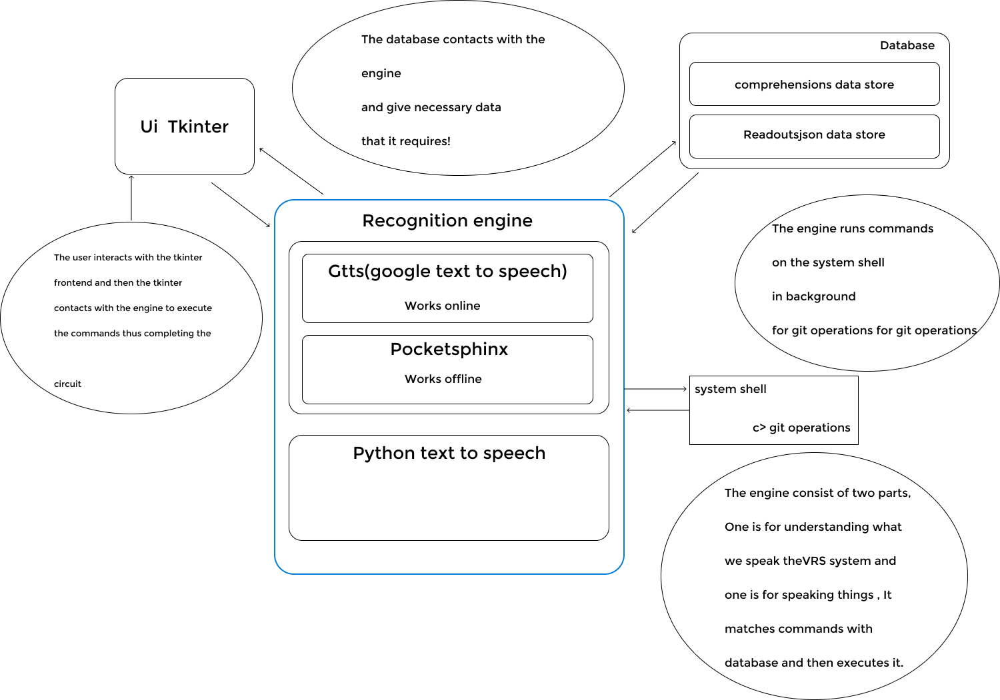
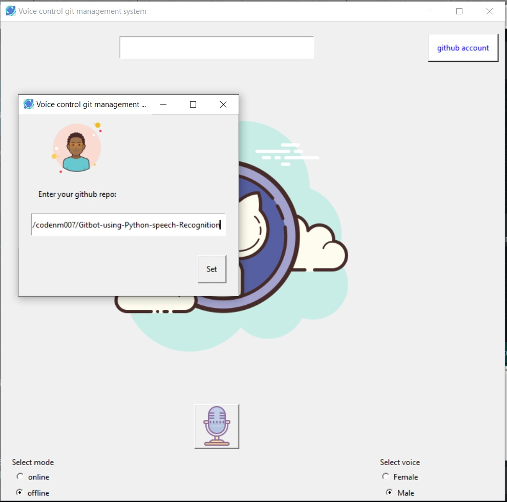
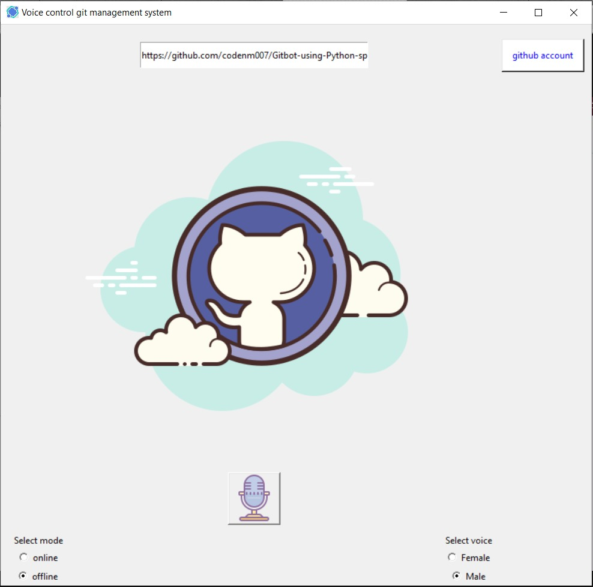
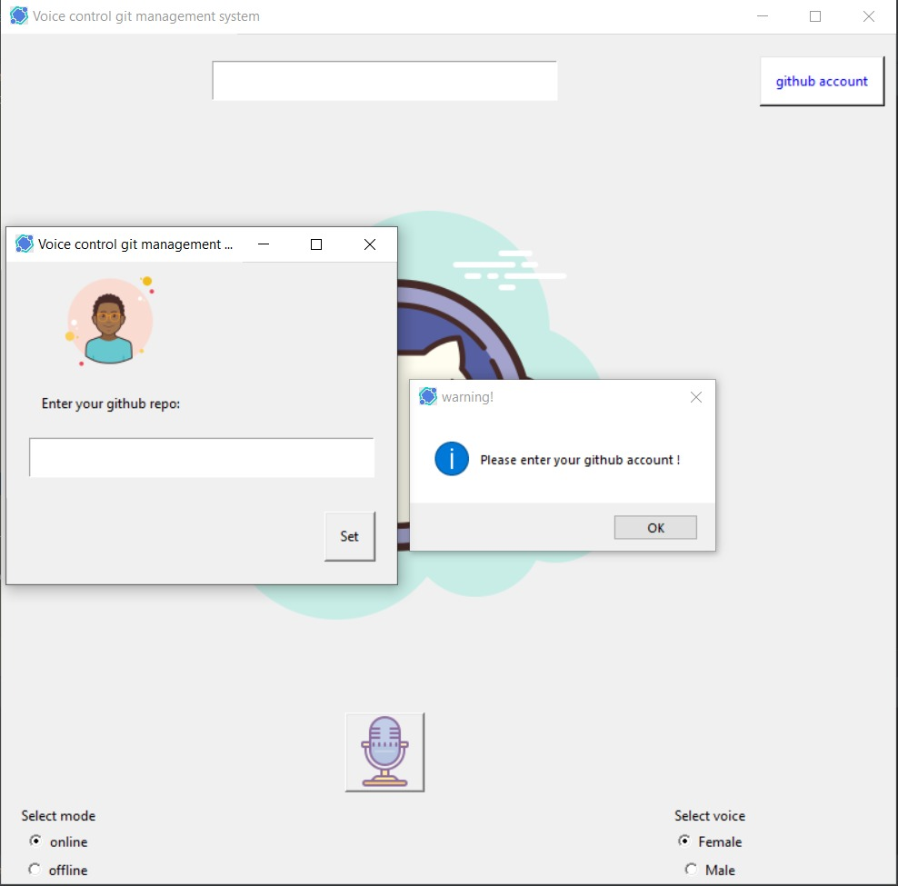

#       Welcome to python gitbot repo!
>Dependences used in projects (***Must install***)
> * [x] Pyaudio
> * [x] Pocketsphinx
> * [x] Speechrecognition
> * [x] Sphinxbase
> * [x] Sphinxtrain
> * [x] Tkinter
> * [x] Pillow

###     Working model of our app


###     Features of our app

> * [x] Online recognition
> * [x] Offine recognition (using pocketsphinx)
> * [x] Basic git commands
> * [x] Voice interaction
> * [x] Friendly UI

###     Supported git commands
|git commands   | voice commands |
| ----- | ----- |
| ```git status```  | what's the status |
| ```git add .```  | backup my code |
| ```git commit -m "commited by viki the gitbot"```  | commit my code |
| ```git push origin master```  | upload to cloud |
| ```git pull origin master```  | update |

###     Fun with the Gitbot
* what is your name, tell me your name, hi, hello
* what's the time, time
* tell me about yourself

____

####        Homepage


####        Setting remote repo


####        After remote repo setup


####        Invalid/empty git account
